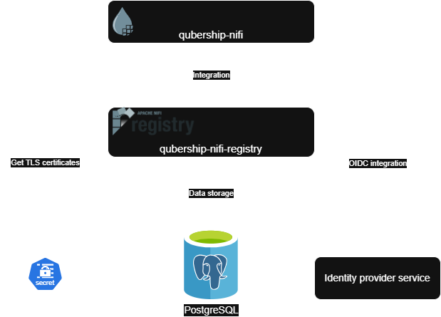

# qubership-nifi-registry

qubership-nifi-registry is a service built on top of Apache NiFi Registry.
Compared with Apache NiFi Registry it supports:
1. additional environment variables for configuration
2. configuration parameters for PostgreSQL DB storage
3. migration process for moving from file-based storage to DB storage.

## Status


## Overview



qubership-nifi-registry serves as version control tool for qubership-nifi (or Apache NiFi in general).
Depending on configuration, it relies on:
1. externally provided TLS certificates: TLS is required for security to be enabled, so TLS certificates are need for all configurations, except may be configuration for local development
2. identity provider service: required for OIDC integration, if it's enabled
3. PostgreSQL DB: required, if DB storage is used. Alternative is to store data on disk with H2 DB (metadata DB), files (flow storage and users/policies information).

## Build
### Prerequisites

Build process requires the following tools:
1. Java - JDK 17 or JDK 21
2. Maven - Maven 3.x, see [maven installation guide](https://maven.apache.org/install.html) for details on how to install
3. Docker - any version of Docker Engine or any compatible docker container runtime.

### Project build

To execute maven build, run:
```shell
mvn clean install
```

Once maven build is completed, you can execute docker build. To do that, run:
```shell
docker build .
```

## Documentation

### Installation Guide

[Installation Guide](docs/installation-guide.md)

### Administrator's Guide

[Administrator Guide](docs/administrator-guide.md)

### User Guide

Apache NiFi Registry is a service providing version control, abilities to export/import for Apache NiFi flow. Refer to Apache NiFi Registry [User Guide](https://nifi.apache.org/docs/nifi-registry-docs/html/user-guide.html) for basic usage.